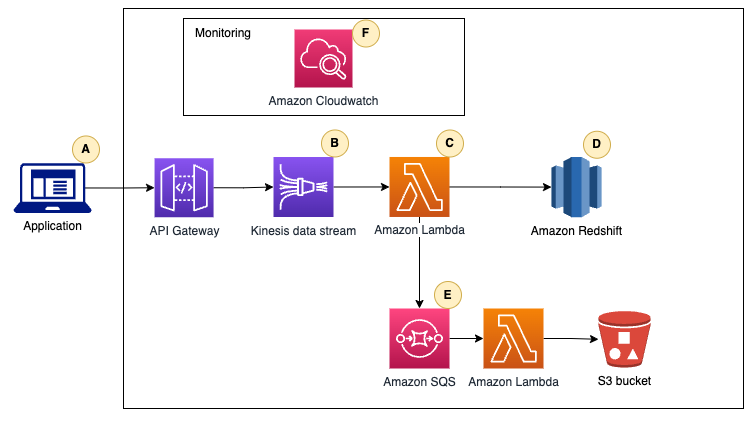

# Part 2 - Infrastructure

During your work on Part 1, you discover that the mobile app is not sending all the necessary user behaviour events. You discuss it with the customer and they agree to collect and send the required, new user behaviour events.
Assume that:
- You are using a distributed pub-sub style technology cluster such as Apache Kafka/AWS Kinesis/Azure EventHubs 
- Other groups at the customer will need streaming access to the data

Requirements:

- User behaviour event data needs to be consumable from the pub-sub Cluster within 120 seconds of being created by the mobile application.
- Data Analysis team will need access to an environment to perform on-demand adhoc analysis
- Data Science team will need cleansed and backfilled data both on stream and batch capacity to build, train and re-train their models 

Your task is to: 
1. Design a workflow to move the user behaviour event data from the application to a backend and provide insights into the data pipelines that you foresee.
2. Explain how the workflow would provide the data to the batch process in Part 1 Algorithm. 
3. Explain any adaptations that your work from Part 1 - Algorithm would need to work as a streaming process.
4. Highlight any important design decisions you make, and describe briefly why you made those decisions. Important parts to address include:
    - Latency
    - Scalability & Data Volume
    - Robustness
    - Failure Modes
    - Delivery Guarantees
    - Technology selections

## Solution
**1.** Workflow to move the user behaviour event data from the application to a backend.

Workflow description:
- (A) The application send the event to An Amazon API Gateway REST API that acts as a proxy to Amazon Kinesis Data Streams.
- (B) Amazon Kinesis Data Streams to store the incoming streaming data.
- (C) AWS Lambda function that processes the records from the data stream.
- (D) Amazon Redshift warehouse, because of its SQL interfaces and the ease with which it processes petabytes of data. Reports, analytics, and visualizations are powered using Periscope Data. In such a way, the data is easily spread across different teams, allowing them to make decisions based on data.
- (E) Errors and failed records that occur during AWS Lambda processing are annotated, and the events are stored in Amazon Simple Queue Service (Amazon SQS). The queue stores metadata for failed batch records and Lambda errors, allowing customers to retrieve these records and determine the next steps to resolve them.
- (F) An Amazon CloudWatch dashboard monitors application health, progress, resource utilization, events, and errors. 

**2.** The workflow design will provide the data to the batch process in Part 1 through Redshift using standard JDBC or ODBC connections.

**3.** In Part 1, 

**4.** Important decisions:
    -  Serverless design.
    -  I decided to use Amazon Kinesis data stream because...
    -  With this design we can guarantee the delivery message and the trace 
    
